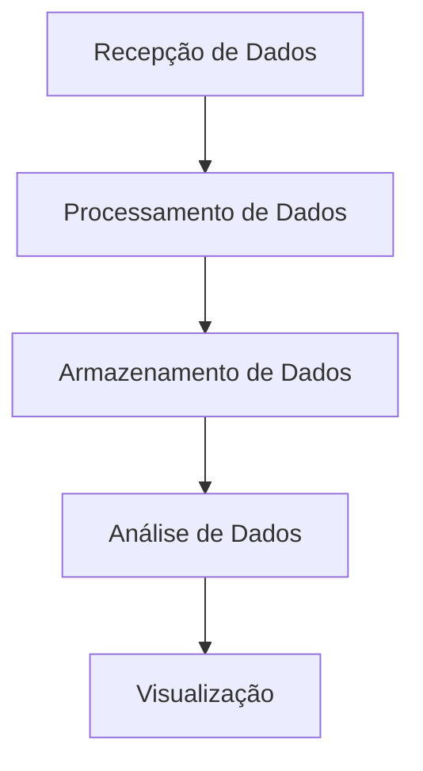
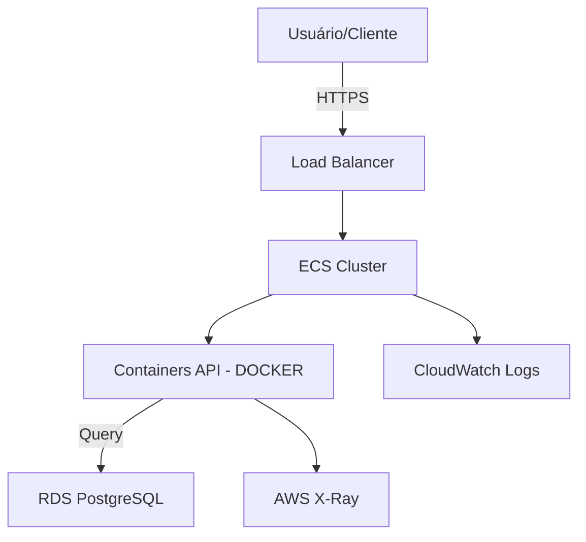

Criação da visão do Cliente para os fundos de investimento com valores aplicados.

# Statement 

Sistema: 
recebe dados da Agencia, Conta e DAC (Digito verificador cadastrado)
e retorna o Código do Produto bem como saldo investido. 

## 1 Visão Geral
A Solução em questão centraliza a visão do cliente em relação aos fundos investidos. 

## 2 Ingestão e Consumo
A ingestão é um processo único da solução que agrega toda a lógica necessária para garantir o funcionamento do negócio. 

## 3 Diagrama de Arquitetura

### 2.1 Ingestão dos Dados (statement)

**Arquitetura Geral**

RabbitMQ - Arquitetura de mensagem: Podemos de forma geral, configurar o recebimento de json para persistencia dos dados, worker adicionado para este tipo de ingestão

Consumidor: Um consumidor genérico será responsável por processar as mensagens da fila.
Após o processamento, os dados serão persistidos no banco de dados. (Migrations gerado)

### 2.2 API de Consulta de Extratos (Statement)

**Endpoint:** ´/apiv{version}/assets/statement

**Método:** GET

**Parametros de entrada**

**Agencia**
**Conta** 
**DAC**: Digito verificador 

**Start Date**: Data de inicio da pesquisa 
**End Date**: Data limite do período pesquisado
**

**`IsDraft (boolean)`** Caso true considera registros como rascunhos, caso false considera registros como não rascunhos, sendo o valor default é false. 

**Parâmetros de Saída**

**Nome do Produto de investimento**
**Código do Produto**
**Saldo Investido** 

### 2.3 Cadastramento (statement)

Adicionei métodos de cadastramento da Account do cliente, bem como a inserção de novos fundos de investimentos que podem ser investidos. 
para o extrato do cliente utilizamos o mapeamento de dados, trazendo o relacionamento um para muitos e inserindo as tabelas accounts, cash_composition e investments, responsáveis em armazenar os dados através do Schema statement - utilizando o Banco de dados PostGres

### 4 Descrição do Processo de Deploy: 

**A API será empacotada como uma imagem Docker.**
Um arquivo docker-compose.yml foi adicionado para facilitar testes locais e execução.
**No ambiente de produção:**
O ECS executará os containers da API.
O RDS gerenciará os dados de maneira segura e escalável.
Logs e métricas estarão disponíveis no CloudWatch.

Amazon ECS com Fargate: Gerenciamento simplificado, sem necessidade de provisionar servidores.

RDS PostgreSQL: Reduz a sobrecarga operacional com backups e alta disponibilidade automáticos.

CloudWatch e X-Ray: Fornecem monitoramento detalhado, rastreamento e resolução de problemas.